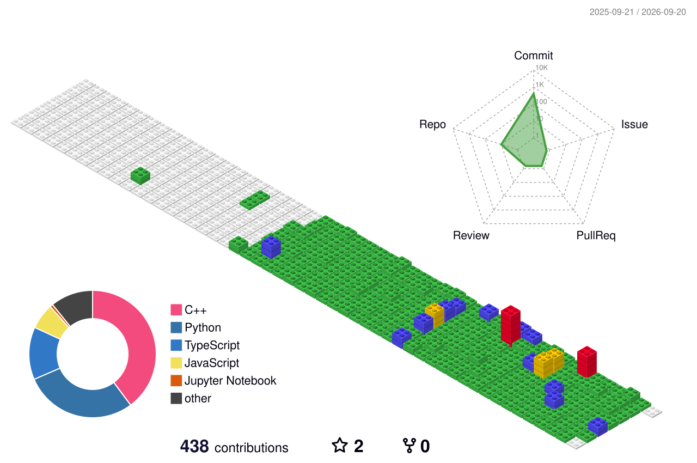
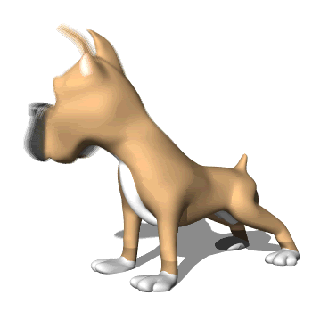

<div align="center">


<!-- 🌊 OCEAN TOP -->


<br/>

<a href="https://git.io/typing-svg">
  
</a>

<br/><br/>

[](https://www.linkedin.com/in/nitin-kumar-882743280/)
[](mailto:nitinkumar18ad@gmail.com)
[](https://github.com/nitinkumar18ad)
[](https://github.com/nitinkumar18ad)

</div>

---

## 👨‍💻 About Me

```python
class NitinKumar:
    def __init__(self):
        self.name       = "Nitin Kumar"
        self.role       = "AI Engineer & Full-Stack Developer"
        self.focus      = ["Generative AI", "AI Agents", "Full-Stack Apps"]
        self.stack      = ["Python", "FastAPI", "LangGraph", "React", "MongoDB"]
        self.currently  = "Building practical AI & full-stack applications"
        self.learning   = ["MCP servers", "LangChain agents", "Production deployment"]
        self.fun_fact   = "I let AI debug my AI projects 🤖"

    def say_hi(self):
        print("Thanks for dropping by! Let's build something amazing together 🚀")

me = NitinKumar()
me.say_hi()
```

---

## 📊 GitHub Stats

<div align="center">


&nbsp;&nbsp;


<br/>


</div>

---

## 🏙️ 3D Contribution Calendar

<div align="center">
  
</div>

---

## 📈 Contribution Graph

<div align="center">
  
</div>

---

## 🛠️ Tech Stack

<div align="center">

**Languages**


**AI / ML**


**Frontend & Backend**


**Databases & DevOps**


</div>

---

## 🚀 Featured Projects

<div align="center">

| 🏥 [AI-HealthCare](https://github.com/nitinkumar18ad/AI-HealthCare) | 🔬 [AI-Skin-Disease-Detector](https://github.com/nitinkumar18ad/AI-Skin-Disease-Detector) | 🔐 [Password-Manager](https://github.com/nitinkumar18ad/Password-Manager) |
|:---:|:---:|:---:|
| AI-powered healthcare assistant using FastAPI & LLMs | Computer vision model to detect skin diseases from images | Secure encrypted password storage & retrieval |
|   |   |   |

</div>

---

## 🐾 ANI — My GitPet Companion

<div align="center">
  
  <br/>
  <sub>Animated companion from the <a href="https://github.com/nitinkumar18ad">GitPet</a> project</sub>
</div>

---

## 🎯 Currently Working On

| 🔧 What | 📌 Why |
|--------|--------|
| 🤖 AI agents with LangGraph & MCP | Pushing the boundaries of autonomous AI |
| 🌐 Full-stack production apps | Learning real-world deployment |
| 📈 GitHub profile & project quality | Building a dev brand that stands out |
| 🚢 Docker + CI/CD workflows | Shipping code the right way |

---

## 🤝 Let's Connect

<div align="center">

💬 Always open to collaborate on AI projects, full-stack apps, or anything interesting!

[](https://www.linkedin.com/in/nitin-kumar-882743280/)
[](mailto:nitinkumar18ad@gmail.com)

</div>

---

<!-- 🌊 OCEAN BOTTOM -->
<div align="center">
  
</div>

<div align="center">


*"Any sufficiently advanced technology is indistinguishable from magic." — Arthur C. Clarke*

<br/>

⭐ **If you find my work helpful, drop a star on a repo — it means a lot!**

</div>
